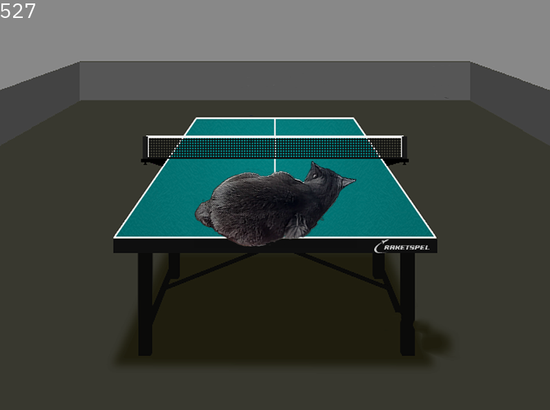

# alpha-blending

Even smaller demonstration of SIMD optimizations.

## Table of contents
* [Prerequisites](#prerequisites)
* [Installation and setup](#installation-and-setup)
* [Usage](#usage)
* [Perfomance](#perfomance)

## Prerequisites
* `git`
* `make`
* `g++`
* `SFML`
* CPU with support of AVX/AVX2 instruction set(see more [here](https://www.laruence.com/sse/ "Intel Intrinsic's Guide"))

Program was built and tested on Linux 6.1.21-1-MANJARO.

## Installation and setup
1. Download all source files into one folder:
```
$ git clone https://github.com/princess-oregano/alpha-blending
```
2. Open the subfolder with source files and build with Make:
```
$ cd alpha-blending/
$ make
```
The program will build and run.

3. To remove all object files:
```
$ make clean
```
4. To remove all files built by `make`:
```
make distclean
```

## Usage
No usage, just enjoy the view of a cat on a tennis table. :)

**But** if you want to change level of optimizations, then:
* no keys - no optimization
* `F1` - SIMD optimization, computes 4 pixels in one iteration
* `F2` - SIMD optimization, computes 8 pixels in one iteration

## Perfomance

Without AVX optimization:


With AVX optimization(4pix):


With AVX optimization(8pix):


